# Lanyard - Conference Intelligence for Grain's Sales Team

> **Take-home submission for the Sales AI Builder role at Grain.**
> One web app that turns conferences from a scattered, gut-feel expense into a measurable
> pipeline engine - *decide* which events to attend, *plan* team coverage across the year,
> *capture* leads on the show floor, *recognize* relationships that build across events, and
> *sync* the qualified ones into HubSpot.

**A lanyard holds your badge - your identity on the show floor.** This tool is about that
identity: recognizing who you met, across events, and acting on the relationships that develop.

| | |
|---|---|
| 🔗 **Live app** | **https://grain-sooty.vercel.app** |
| 🔑 **Demo login** | `demo@grain.com` · `LanyardDemo!2026` |
| 💻 **Source** | https://github.com/shaiaviv/lanyard |
| 🎥 **Video walkthrough** | _[see the Demo Video section below](#-demo-video)_ |

The live app comes pre-seeded with **190 real, web-researched conferences**, a 6-person sales
team with deliberate coverage gaps, and 20 contacts (10 of them recurring across multiple events,
covering every relationship verdict) - so every feature has real data behind it the moment you
log in.

---

## Table of contents

1. [The 60-second pitch](#the-60-second-pitch)
2. [The three experiences](#the-three-experiences) - Field · Reconcile · Planning (with screenshots)
3. [How it maps to the brief](#how-it-maps-to-the-brief) - every required component, where it lives
4. [The ICP scoring methodology (defended)](#the-icp-scoring-methodology-defended)
5. [Cross-conference intelligence (the signature feature)](#cross-conference-intelligence-the-signature-feature)
6. [The AI features - and why AI is the right tool for each](#the-ai-features--and-why-ai-is-the-right-tool-for-each)
7. [The path into HubSpot](#the-path-into-hubspot)
8. [How it scores against the evaluation criteria](#how-it-scores-against-the-evaluation-criteria)
9. [Architecture & tech stack](#architecture--tech-stack)
10. [How I worked with AI to build this](#how-i-worked-with-ai-to-build-this)
11. [Run it locally / deploy your own](#run-it-locally--deploy-your-own)
12. [Demo video](#-demo-video)
13. [What I'd build next](#what-id-build-next)

---

## The 60-second pitch

Conferences are one of Grain's primary pipeline channels, but the workflow is fragmented across
spreadsheets, Slack threads, and individual notebooks. **Lanyard is one app with three
experiences**, each built for a different moment in the conference lifecycle:

- **FIELD** *(mobile, PWA)* - the rep on a loud show floor. **Talk for ten seconds and walk away**;
  the AI transcribes, parses, scores the lead's fit, and checks "have I met them before?" in the
  background. Capture is never blocked on the network or the model.
- **RECONCILE** *(desktop / hotel-at-night)* - turn the day's fast, fuzzy "maybes" into
  high-confidence contact records. This is where uncertain matches get resolved by a human.
- **PLANNING** *(desktop)* - the sales lead's strategy hub. ICP-scored conference database,
  year-long team coverage on a timeline **and** a map, cross-conference relationship intelligence,
  AI coverage planning, AI event discovery, and a curated push into HubSpot.

---

## The three experiences

### 🟠 FIELD - capture on the show floor

The rep has 30 seconds before the next conversation. The hero action is a single button: **talk,
then walk away.** The AI transcribes, parses out name/company/title/topics, scores the lead's ICP
fit, and runs the cross-conference matcher - all in the background. Nothing blocks on the network
(captures queue offline and drain on reconnect) and nothing blocks on the model.

| Voice-first capture | Manual fallback | In-the-moment relationship arc |
|---|---|---|
| 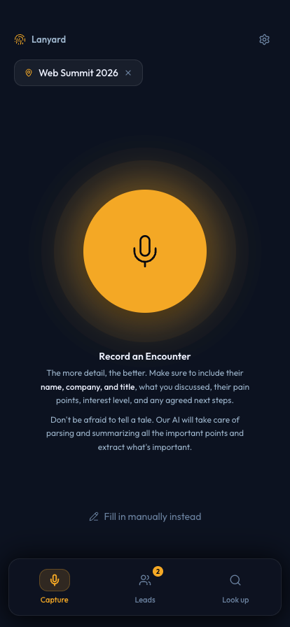 | 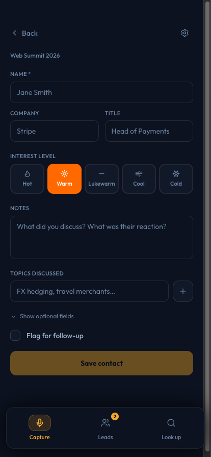 | 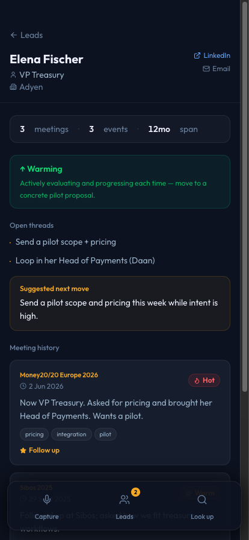 |

- **Capture** picks up the active conference automatically and leads with voice; "fill in manually"
  is one tap away. The manual form keeps the same fast shape - a **5-point temperature ladder**
  (Hot → Cold), topic chips, and a follow-up flag.
- **Temperature (their interest) is kept separate from ICP fit (our assessment)** - two different
  axes that combine into a chase / nurture / be-polite / deprioritize decision, instead of one
  muddy score.
- **The contact arc page** is the in-the-moment version of the job's "pre-meeting brief": the
  verdict (*Warming*), the open threads, the AI's suggested next move, and the full
  cross-conference meeting history - folding in *every* rep's encounters (shared team memory).

| "Look up before you approach" | Settings - user-configurable, encrypted keys |
|---|---|
| 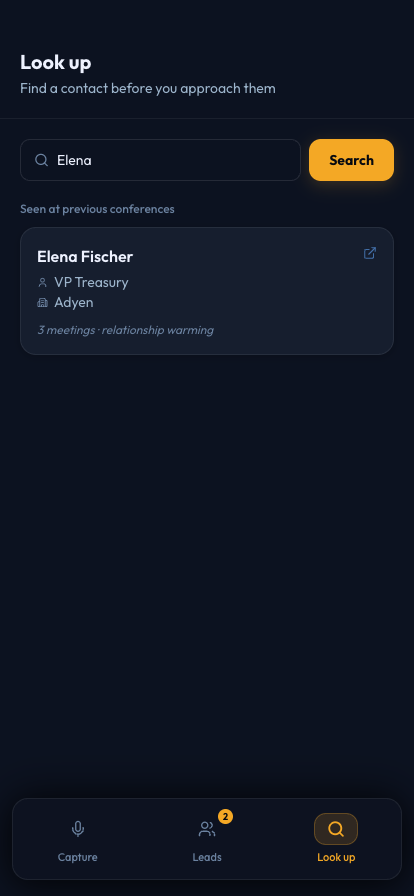 | 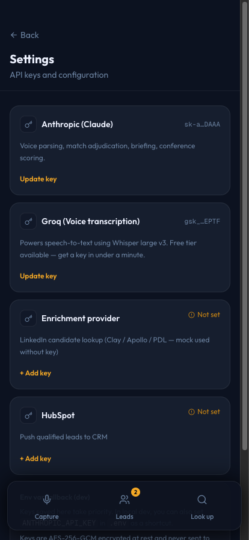 |

- **Look up** is the proactive brief: search a name *before* you walk over, and see "3 meetings ·
  relationship warming" so you know what you're walking into.
- **Settings** is how the "keys are user-configurable, not hardcoded" constraint is honored -
  per-service, masked, encrypted, with a clear note about what each key powers and a graceful
  mock fallback when one isn't set.

### 🔵 RECONCILE - turn maybes into confident records

Field is fast and forgiving; Reconcile is slow and strict - because a wrong hint on the floor is
harmless (the rep shrugs it off), but a wrong *committed record* is corrosive (it kills trust and
the tool dies). That's why capture and commit are deliberately separate surfaces. The day's
uncertain captures land in an inbox, and the rep resolves them one at a time with full context.

| The inbox | The resolve card |
|---|---|
| 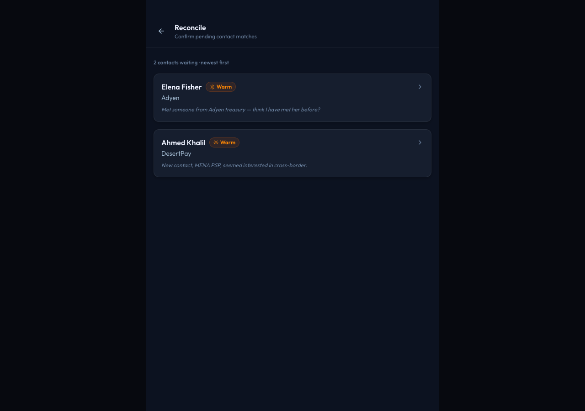 | 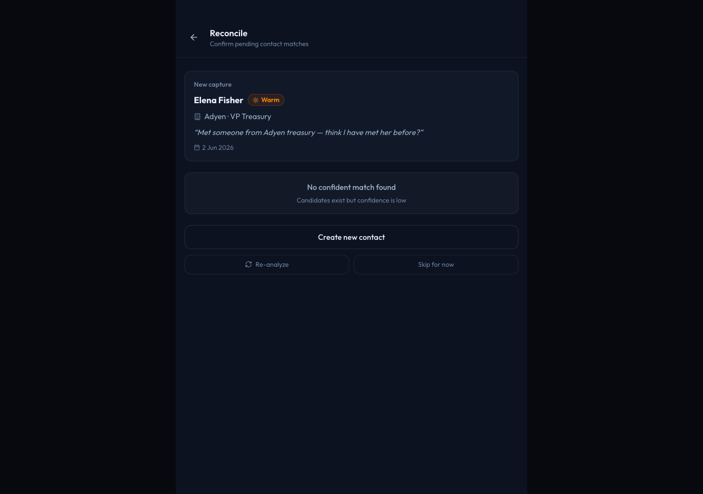 |

- The seeded inbox includes a deliberate **name-variation** case: a floor capture of *"Elena
  **Fisher**, Adyen treasury - think I've met her before?"* against the existing contact *Elena
  **Fischer**, Adyen*.
- The resolver **never auto-merges a "maybe."** When confidence is low it says so plainly
  ("Candidates exist but confidence is low") and offers **Match / Create new / Re-analyze (Sonnet)
  / Skip**. *Re-analyze* re-runs the matcher with a stronger model - richer than the snap judgment
  the floor could afford. A bad merge corrupts the record forever; a deferred decision costs
  nothing. We optimize for the cheap mistake.

### 🟡 PLANNING - the strategy hub

A company-wide hub (not a personal planner) with five tabs. The **Overview** is the landing page -
"here's what needs your attention" - and every card deep-links into the tab that acts on it.

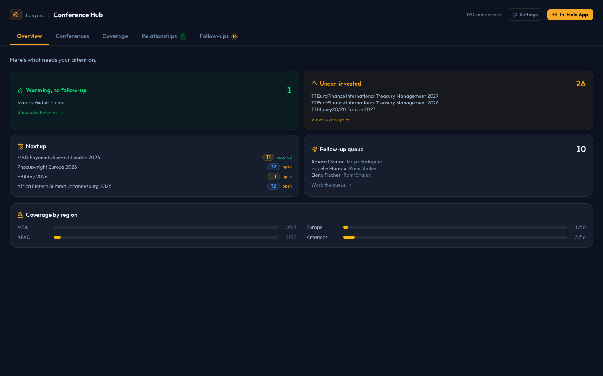

The other four tabs are covered in detail in the sections below:
[Conferences & scoring](#the-icp-scoring-methodology-defended) ·
[Coverage planning](#coverage-planning--timeline-map-and-gaps) ·
[Relationships](#cross-conference-intelligence-the-signature-feature) ·
[Follow-ups → HubSpot](#the-path-into-hubspot).

---

## How it maps to the brief

Now that you've seen what got built, here's every required component from the brief mapped to
exactly where it lives in the app:

| # | Brief requirement | Where it lives | Status |
|---|---|---|---|
| 1 | **Conference list + filtering view** | Planning → **Conferences** tab - 190 real events; filter by tier, vertical (Fintech / Payments / Treasury / Travel / SaaS / Banking), and past/upcoming | ✅ |
| 2 | **A scoring / tiering system** | Planning → **Conferences** - a real ICP-fit engine with **live, tunable weight sliders** and per-factor AI rationale; tiers T1 / T2 / T3 | ✅ |
| 3 | **A planning view** (year coverage, under-investment, geo/temporal clustering) | Planning → **Coverage** tab - month timeline **+** world map, region/quarter gap bars, "under-invested" alerts, and trip clustering | ✅ |
| 4 | **A field interface for capturing leads** | **Field** experience - voice-first capture, <10s, offline-tolerant; manual path as fallback | ✅ |
| 5 | **Cross-conference contact tracking** (name variations, job changes, warming vs. tire-kicker, the right nudge) | Planning → **Relationships** tab + the matching engine + the AI arc summarizer + the Reconcile flow | ✅ |
| 6 | **At least one meaningful AI feature** | **Seven** shipped - see [the AI section](#the-ai-features--and-why-ai-is-the-right-tool-for-each) | ✅ |
| 7 | **A path to push leads into HubSpot** | Planning → **Follow-ups** - curated handoff (arc + ICP fit as a note), deduped by email, bulk push | ✅ |

**Constraints from the brief, also met:**

- ✅ **Deployable without a complex pipeline.** Push to `main` → Vercel auto-deploys. The whole
  backend is one Supabase project + one SQL file (`supabase/setup.sql`). A non-developer can host
  and update it.
- ✅ **API keys configurable by the user, not hardcoded.** All service keys (Anthropic, Groq,
  enrichment, HubSpot) are entered in the in-app **Settings** screen, **AES-256-GCM encrypted at
  rest**, decrypted server-side only, and never sent to the browser. Only infrastructure keys
  (Supabase, the encryption secret) live in env - you can't store the database's own credentials
  inside the database.
- ✅ **AI used throughout the build** - and documented. See
  [How I worked with AI](#how-i-worked-with-ai-to-build-this) and `.claude/JOURNAL.md`.

---

## The ICP scoring methodology (defended)

> *The brief: "Rank conferences by ICP fit. You decide the methodology and defend it."*

Grain's ICP is concentrated in **fintech, payments, treasury, and cross-border / FX**. The core
belief baked into the methodology is **quality over headcount**: a 600-person treasury summit full
of FX-risk owners is worth more to Grain than a 70,000-person generalist tech expo.

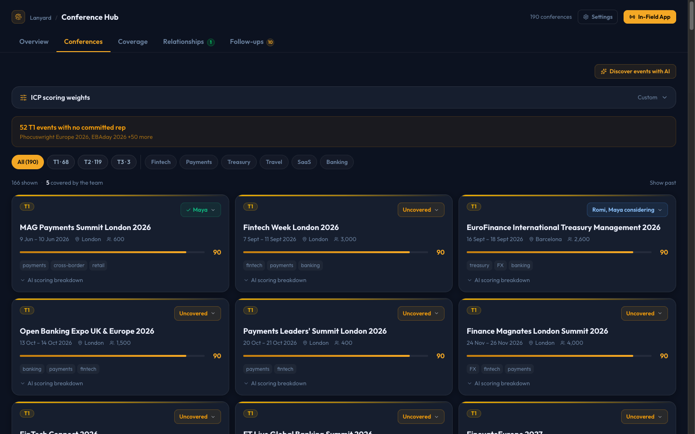

### The formula

Each conference gets a **0–100 score** = a weighted average over five factors. The **default
weights** (tunable - see below):

| Factor | Weight | What it measures |
|---|---:|---|
| **ICP Density** | **40%** | Share of attendees who are the right *companies AND roles* (PSPs, neobanks, treasury teams, FX-exposed platforms). Weighted highest on purpose. |
| **Topic Fit** | **25%** | Does the agenda actually attract payments / fintech / treasury / FX? |
| **Scale** | **15%** | Relevant audience size - *capped*, so raw headcount can't dominate. |
| **Geo Relevance** | **10%** | In or near Grain's target markets (EU core today). |
| **Historical Perf** | **10%** | Pipeline from past attendance - for repeat events only. |

**Tiers:** **T1 ≥ 75** (must-attend) · **T2 ≥ 50** (consider) · **T3 < 50** (skip).

Two deliberate design choices:

- **A null factor is dropped and its weight redistributed.** A brand-new event with no track
  record isn't penalized for having no `Historical Perf` - the other four factors simply absorb
  that 10%.
- **Cost is *not* a fit factor.** "Is this event worth attending?" and "can we afford it?" are
  different questions; folding budget into fit would muddy the signal.

### Why it's defensible: transparent + grounded + tunable

The hard part of scoring conferences is estimating the fuzzy factors (how ICP-dense *is* Sibos?).
That's a research-and-judgment task - exactly where an LLM earns its place. So the split is:

> **AI estimates the factors (once per conference). A deterministic formula turns them into a
> score (live, on every slider drag - zero AI calls).**

- **Transparent** - expand any card to see each factor's value *and the AI's one-line rationale*
  ("Merchant-led; cross-border and merchant payments owners"). Nothing is a black box.
- **Tunable** - the **ICP scoring weights** panel has live sliders. Drag one and the entire list
  **re-scores, re-ranks, re-tiers, and re-filters instantly**, with no AI round-trip. A team that
  cares more about geography than topic can encode that in five seconds.
- **Overridable** - on a conference's detail page, every AI-estimated factor is itself a slider:
  "the AI estimate is a guess - adjust it if you know better."

| Per-factor AI rationale | Live weight sliders (the methodology, tunable) |
|---|---|
| 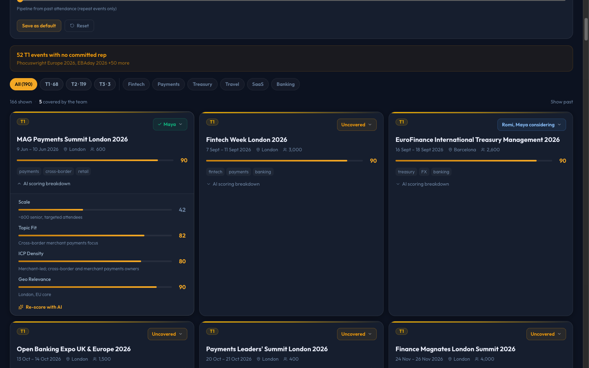 | 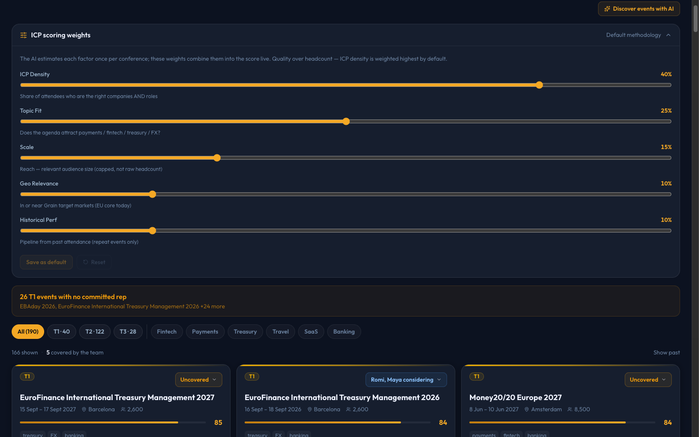 |

**The result holds up at scale.** Across all 190 events the ranking lands where Grain's GTM
intuition would: treasury/payments-dense events on top (EuroFinance Treasury ~85–90, Money20/20
Europe ~84, MAG Payments Summit 90), broad fintech in the middle, travel borderline (ITB ~52), and
generalist tech at the bottom (Web Summit ~48, SaaStr ~44). The quality-over-headcount story shows
up directly in the numbers.

The same "AI fills the inputs, deterministic code turns them into the answer" pattern is reused
everywhere in the app (lead-fit scoring, matching, coverage planning) - one coherent stance on
where AI belongs, not a bag of bolted-on tricks.

### Conference detail - drill into any event

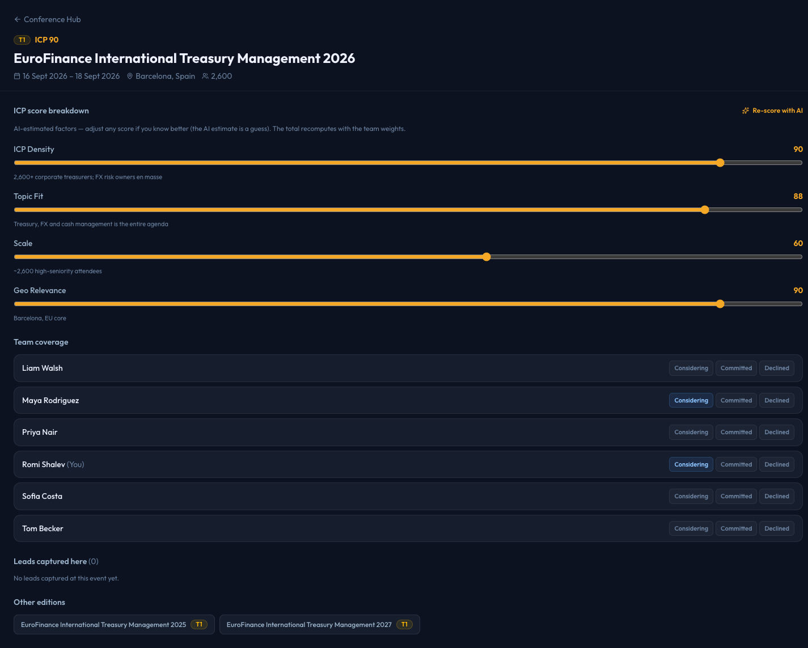

Each event has its own page: the factor breakdown with **override sliders**, **team coverage
assignment** (assign any teammate Considering / Committed / Declined), leads captured at that event
with a "push qualified to HubSpot" action, and links to **other editions** of the same series.

---

## Coverage planning - timeline, map, and gaps

> *The brief: "Show coverage across the year, where we're under-invested, and where multiple events
> cluster geographically or temporally."*

The **Coverage** tab answers "are we covering the right events, with the right people, without
wasting travel?" - across the whole team, all year. It has two synchronized lenses over the same
data.

| Timeline + gap analysis | Geographic clustering (map) |
|---|---|
| 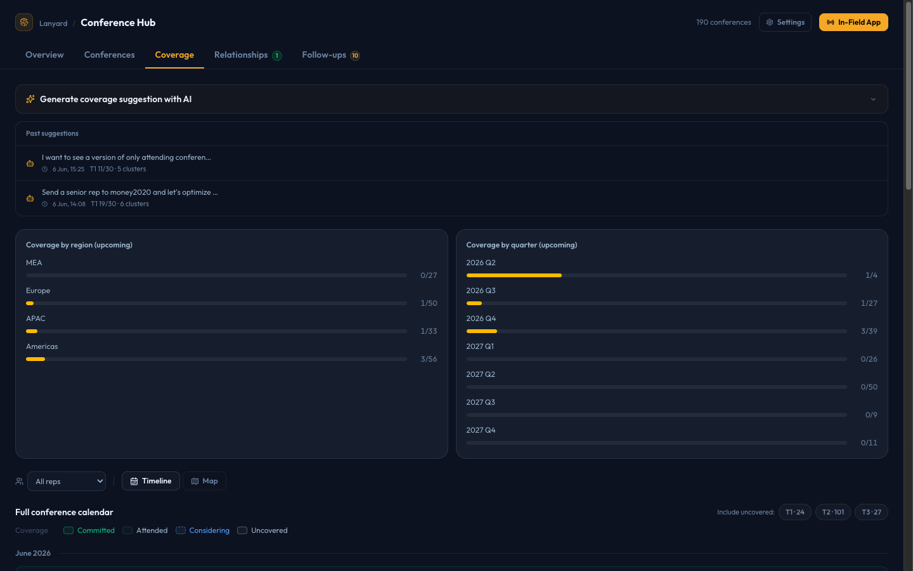 | 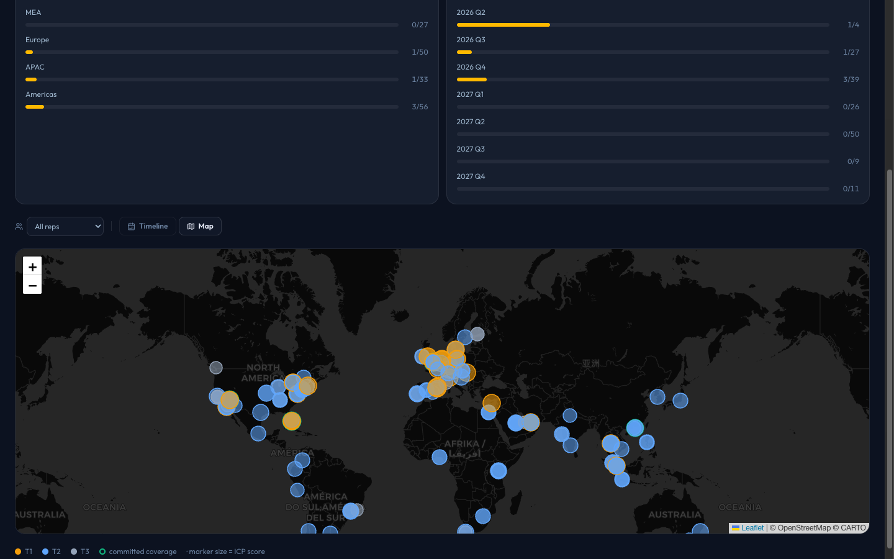 |

- **Where we're under-invested** - region and quarter gap bars (e.g. *MEA 0/27*, *Europe 1/50*)
  make thin coverage obvious at a glance, and the "T1 events with no committed rep" alert lists the
  must-attend events nobody owns. The nudge is deliberately scoped to **T1 only** - flagging every
  uncovered T1+T2 event would surface ~130 items and read as noise (the brief's exact warning), so
  it's trimmed to the ~couple-dozen events that actually demand a decision.
- **Temporal clustering** - the month-by-month calendar shows where events bunch up in time, so a
  rep can chain a single trip instead of flying out twice.
- **Geographic clustering** - the **map** (tier-colored markers, sized by ICP score, green ring =
  committed coverage) makes spatial clusters jump out: a dense London/EU cluster, a US East-Coast
  cluster, a Singapore/APAC cluster. That's where "send one rep for a week" beats five separate
  trips.
- **One render path, two data sources** - the same timeline and map also render an
  [AI coverage *draft*](#-core-feature-2--ai-coverage-planning-the-biggest-time-saver) when one is
  loaded, so previewing a proposed plan looks identical to the real one.

---

## Cross-conference intelligence (the signature feature)

> *The brief: "When the same person is encountered at multiple conferences, recognize it and
> surface the pattern… help the rep judge whether a repeat contact is a warming relationship worth
> closing, or a polite tire-kicker who's been listening for a year and never buying… handle name
> variations, job changes between events, and what the right nudge looks like."*

This is the brief's most-weighted, hardest criterion, so it gets the most attention. It's built in
three layers.

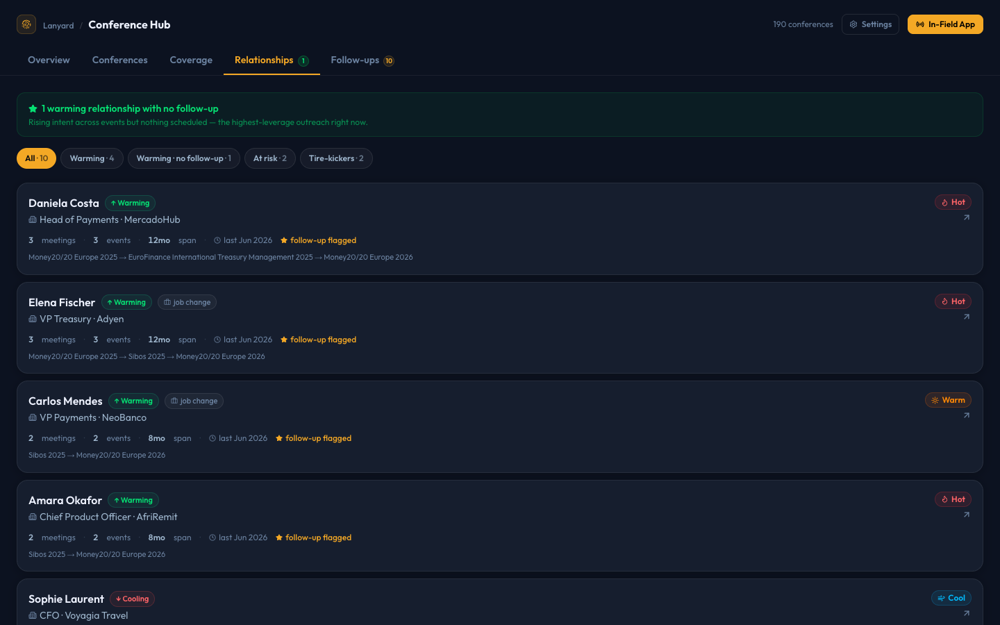

### 1. Recognition - robust matching, not a dumb `name ==` join

The data model separates a durable **Contact** (the identity we dedupe) from each **Encounter** (a
specific meeting at a specific conference). "Met them 3 times across events" is a first-class fact,
not a guess. Matching runs in two stages:

- **Retrieve** a shortlist with Postgres `pg_trgm` fuzzy text search (handles typos and ASR
  mangling cheaply; zero candidates ⇒ no AI call at all).
- **Adjudicate** the shortlist with Claude, which reasons over name + company + title together and
  returns a *confidence*. That confidence drives a **three-way outcome**: auto-link (high) /
  surface for confirmation (medium) / new contact + save-for-later (low).

This is why **ASR garbling a name is fine** - "one feature's weakness is another's job." The fuzzy
matcher absorbs what the transcriber mangles.

### 2. Interpretation - the signal carries meaning, not just a count

A count ("met 3×") is noise. The verdict answers *"is this going somewhere?"* The rule is
**movement, not mood** - progression toward commitment across encounters:

- **Warming** - engagement rising across events. *Worth closing.*
- **Nurturing** - steady, genuine, not yet accelerating.
- **Cooling / At-risk** - was warm, going quiet.
- **Tire-kicker** - many touches, no progression. *The "listening for a year, never buying" case -
  named explicitly so the rep stops chasing.*
- **Too-early** - harsh labels are **gated by meeting-count + time**, so we never call someone a
  tire-kicker after one polite chat.

Each card shows the verdict, the temperature, the meeting/event count and time span, and the
**conference trail** (`Money20/20 Europe 2025 → Sibos 2025 → Money20/20 Europe 2026`).

### 3. Edge cases the brief explicitly called out

- **Name variations** - handled by fuzzy retrieval + LLM adjudication, and surfaced in **Reconcile**
  for human confirmation when uncertain (the seeded *"Elena Fisher" → "Elena Fischer"* case).
- **Job changes between events** - each Encounter stores an **identity snapshot**, so when someone's
  title or company changes between meetings we *detect it and flag it* ("job change" badge - e.g.
  *Elena Fischer, Director → VP Treasury*) instead of treating it as a mismatch. A promotion in
  your buyer is a buying signal, not an error.
- **The right nudge** - calibrated to avoid both failure modes the brief names. Too aggressive = noise;
  too subtle = invisible. The headline nudge is the single highest-leverage one:
  **"Warming, no follow-up"** - rising intent across events but nothing scheduled. That exact filter
  is one tap, and the count surfaces on the Overview dashboard. Harsh judgments are time-gated so
  they never fire prematurely.

The **AI relationship-arc summarizer** (one of
[the AI features](#the-ai-features--and-why-ai-is-the-right-tool-for-each), shown on the
[contact arc page](#-field--capture-on-the-show-floor)) turns each arc into a one-line verdict +
open threads + a suggested next move - the narrative a rep actually needs, not a data dump.

---

## The AI features - and why AI is the right tool for each

The brief asks for *one* meaningful AI feature and warns against "bolted-on." Lanyard ships
**seven**, and each passes the same test: **AI is right here because the job is synthesis or
judgment over messy, unstructured input - not something a rule or a form could do.**

But they're not all equal. **Two are the core, golden features** - the ones that define how we
think about applying AI to a sales team, and where the product genuinely shines. The other five are
valuable supporting additions, and we treat them as exactly that: each is a knob to tune against
the **value-vs-cost tradeoff** (swap in a cheaper model, cache more aggressively, or make it
optional), not a pillar.

---

### ⭐ Core feature 1 - Voice → structured lead *(the field rep's backbone)*


This is the AI decision we're proudest of, because it didn't come from "where can we bolt on an
LLM" - it came from **putting ourselves in the rep's shoes and thinking through how they'd actually
behave.** On a loud show floor a rep has seconds and split attention; asking them to tab through a
form mid-conversation is something they simply *won't* do. The realistic behavior is a ten-second
voice note as they turn to walk away.

So that's the unlock: the rep says *"met Sarah at Stripe, head of payments, really keen on the FX
stuff, wants a call next week,"* and the AI turns that throwaway sentence into a fully structured,
**scored** lead - name, company, title, topics, temperature, follow-up flag - and runs the
cross-conference "have I met them before?" check, all without the rep breaking stride. **A lot of
data captured, fast, without stealing a second of valuable conference time.**

This is where we best demonstrate how we think about core AI implementation: the value isn't "we
used a model," it's recognizing the *exact moment* AI removes friction a human would otherwise
refuse to tolerate. And it's load-bearing - **everything downstream** (matching, the relationship
arc, follow-ups, the HubSpot handoff) is only ever as good as the data this one feature captures.
It's the backbone of the entire field experience.

> Transcription via **Groq Whisper Large v3 Turbo** (or the browser's free Web Speech API); parsing
> + ICP-fit scoring via **Claude Haiku**.

---

### ⭐ Core feature 2 - AI coverage planning *(the biggest time-saver)*

| The travel itinerary per rep | Non-destructive preview |
|---|---|
| 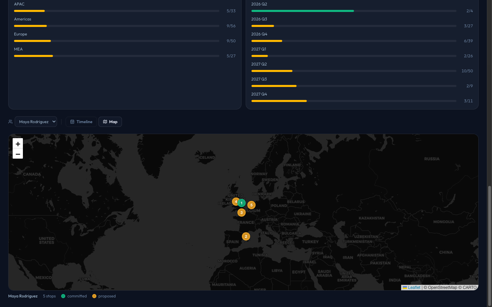 | 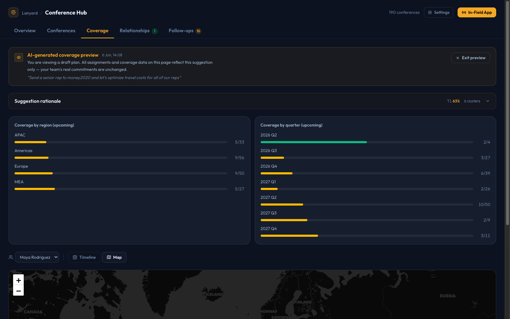 |

This is the single **most time-saving, highest-leverage** AI feature in the product. Planning a
whole team's conference year by hand is hours of fiddly spreadsheet work - who goes where, honoring
committed tickets, never double-booking a rep, clustering trips to cut travel cost, and balancing
coverage across regions and quarters. Here a sales lead just **asks in plain English** ("send a
senior rep to Money20/20 and optimize travel for the whole team") and gets a complete, validated,
year-long allocation in seconds.

What makes it genuinely unique is that it's **not a single button - it's unlimited AI plans from
custom prompts.** Generate as many as you like, each from a different instruction - *"minimize total
travel," "maximize T1 coverage in APAC," "cap everyone at four trips"* - and compare the drafts side
by side; each is saved and shareable by URL. That turns conference planning from a one-shot guess
into an interactive what-if tool.

The engineering is the same hybrid stance as our scoring engine: **the AI proposes assignments +
reasoning; deterministic code disposes** - it locks committed tickets, drops any double-booking,
enforces per-rep capacity, and computes the trip clusters and stats, so the AI can never produce an
impossible plan. Each draft opens in a **non-destructive Suggestion Mode** - an unmissable "you're
viewing a draft, your real commitments are unchanged" banner, a numbered per-rep travel route on
the map, and a one-click exit.

---

### The supporting AI features

Genuinely useful, but secondary - each a candidate to dial up or down based on how a team weighs its
value against its cost:

| Feature | Model | Why AI (and not a rule) |
|---|---|---|
| **Lead-qualification (ICP fit) scoring** | Claude Haiku | Judging "is this a Grain-fit company *and* the right person" from a sparse note needs world knowledge + inference; returns *Unclear* when the note is too thin rather than guessing. |
| **Relationship-arc summarizer** | Claude Sonnet | Reads a whole multi-event history → a verdict + open threads + next move. Reading-between-the-lines synthesis, not arithmetic on a counter. |
| **Cross-conference match adjudication** | Claude Haiku / Sonnet | Deciding if "Elena Fisher @ Adyen" is "Elena Fischer @ Adyen" *with a confidence* is fuzzy reasoning a `==` can't do. |
| **ICP conference scoring** | Claude Sonnet | Estimating the fuzzy factors (how ICP-dense is this event?) is research + judgment; the deterministic formula then makes the score transparent and tunable. |
| **AI conference discovery** | Claude Sonnet | "Find ICP-fit events we don't already know about" - open-ended discovery, the brief's own example. |

**AI conference discovery** is worth a quick look, since it's the example the brief itself names:

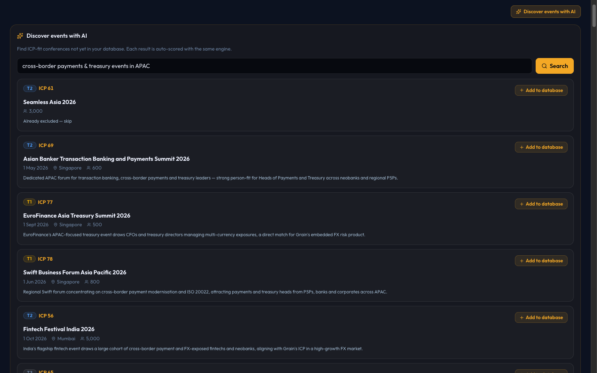

Type a natural-language brief ("cross-border payments & treasury events in APAC") and it returns
real events **not already in your database**, each **auto-scored with the same ICP engine** and a
one-line rationale tied to Grain's ICP ("a direct match for Grain's embedded FX risk product"); it
even flags events you already track ("Already excluded - skip"). One click adds an event, fully
scored.

> **Graceful degradation everywhere.** Every AI feature has a labeled mock/heuristic fallback so
> the app stays fully demoable with **no API keys configured** - discovery returns real sample
> events, coverage planning falls back to a greedy allocator, enrichment uses a mock provider,
> HubSpot shows a labeled demo push. Add a key in Settings and the same flow goes live.

---

## The path into HubSpot

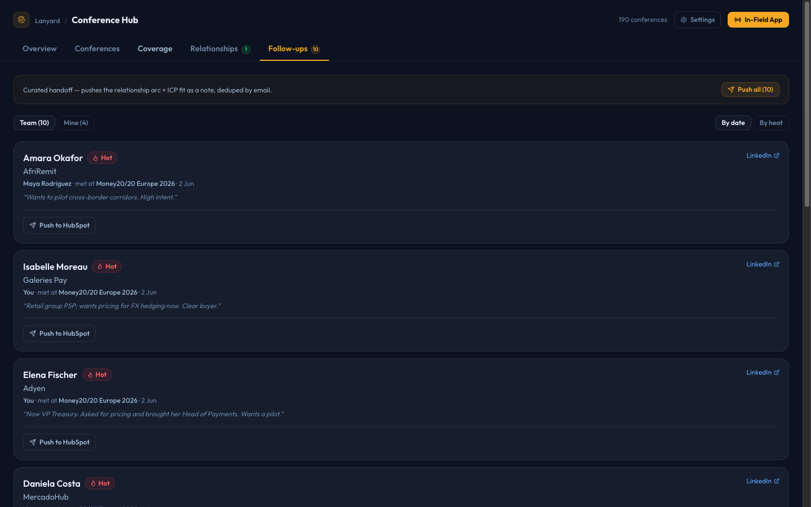

Lanyard is **not** a CRM - it's a *system of engagement* that feeds the *system of record*. The
positioning matters: it's the answer to "why isn't this just a worse HubSpot?" We don't model
deals or pipeline (that's HubSpot's job); we curate which conference leads are worth graduating
into the CRM.

So the push is **not a dumb export.** From the **Follow-ups** tab:

- **Curated** - it pushes the relationship **arc summary as a note**, plus ICP fit, temperature, and
  "met at X" context - the qualified handoff the role is literally hired to deliver, not a row dump.
- **Idempotent** - dedupes by email (search → update or create), so re-pushing doesn't create
  duplicates.
- **Bulk** - "Push all" graduates the whole qualified queue at once; per-conference, a detail page
  can push just that event's hot/strong-fit leads.
- **Configurable & safe** - the HubSpot key lives in encrypted Settings; with no key, the flow runs
  against a clearly **labeled mock** so it's fully demoable.

---

## How it scores against the evaluation criteria

The brief says it grades five things, not code in isolation. Directly:

- **Sales empathy - "built for a salesperson, or a generic CRUD app?"**
  The whole product is shaped around the rep's *moments*, not database tables. Voice-first because
  typing on a show floor is friction. Dark by default because events have ambient lighting.
  Capture separated from commit because reps shouldn't have to be careful when they're busy.
  Briefing-first relationship cards because the rep needs catching-up, not a manager's verdict.
  "Be polite" as a literal lead quadrant. None of this falls out of a CRUD generator.

- **AI judgment - "genuinely useful, or bolted on?"**
  One coherent doctrine - *AI estimates fuzzy inputs; deterministic code makes the decision* -
  applied across scoring, matching, lead-qual, and coverage planning. AI is used where there's
  genuine synthesis/judgment (parsing speech, reading an arc, finding unknown events) and
  deliberately *not* used where a formula is more honest (turning factors into a score, enforcing
  no-double-booking). Cheap models for high volume, strong models for the hard calls. The two
  features that best embody this are deliberately the most prominent:
  [**Voice → structured lead**](#-core-feature-1--voice--structured-lead-the-field-reps-backbone) -
  AI placed at the exact moment of rep friction, capturing rich data from a ten-second voice note -
  and [**AI coverage planning**](#-core-feature-2--ai-coverage-planning-the-biggest-time-saver) -
  the biggest time-saver, generating unlimited prompt-driven team plans while deterministic code
  guarantees every plan is actually valid. The other five are intentionally framed as tunable
  value-vs-cost additions, not pillars.

- **Cross-conference intelligence - "robust matching… useful interpretation, not just a count?"**
  Two-stage matching (fuzzy retrieval → LLM adjudication with confidence), an Encounter/Contact
  model that makes repeats first-class, job-change detection via identity snapshots, name-variation
  resolution through Reconcile, and verdicts based on *progression* with a calibrated, time-gated
  nudge. [Full detail above.](#cross-conference-intelligence-the-signature-feature)

- **Shipping instinct - "scoped smartly and got something working end-to-end?"**
  All three experiences are live and wired to a real database with real seeded data. Scope was cut
  deliberately and logged (e.g. AI follow-up email drafting was dropped because the app already
  ships several stronger AI features - see the journal). The build went *manual-path-first, then
  layer voice → AI → offline* so every step was demoable on its own.

- **Communication - "explain trade-offs clearly?"**
  This README, plus `.claude/JOURNAL.md` - an append-only decision log of the *entire* project:
  every meaningful decision, the alternatives weighed, and what was deliberately *not* done.

---

## Architecture & tech stack

Chosen for the brief's "a non-developer can host and update this" constraint: managed services,
one repo, one SQL file, push-to-deploy.

| Layer | Choice | Why |
|---|---|---|
| **Framework** | Next.js 16 (App Router) on **Vercel** | Server Components + Server Actions; zero-config deploy; push `main` → live. |
| **Backend** | **Supabase** (Postgres + Auth + Storage + Realtime) | One service covers DB, team auth, raw-audio storage (keep the original recording, not just the AI's parse), and shared-memory realtime. |
| **AI** | **Vercel AI SDK v6** + **Claude** (Haiku 4.5 + Sonnet 4.6) | Haiku for high-volume parse / match / fit; Sonnet for briefing / scoring / discovery / planning. Structured output via `generateText` + `Output.object` with **Zod 4** contracts. |
| **Voice** | Browser **Web Speech API** (free, keyless) **or** **Groq Whisper Large v3 Turbo** (server-side) | Two transcription paths; both feed the same parse pipeline. |
| **Maps** | **react-leaflet** + Carto dark OSM tiles | Keyless - no extra API key to host. |
| **Offline** | PWA + IndexedDB capture queue (`idb`) | Honors the dead-Wi-Fi show-floor premise; captures drain on reconnect. |
| **Types** | TypeScript end-to-end; `npx tsc --noEmit` clean | AI ↔ app contracts are typed; client/server type boundaries respected. |

**The capture pipeline** (the core abstraction): `record → persist → upload → transcribe → parse(+fit)
→ enrich → match → draft → review → commit`. It's optimistic and asynchronous - **the rep never
waits on it** - and every stage degrades gracefully (parse fail → manual form; no enrichment key →
skip; zero match candidates → skip the LLM). The **commit** (writing the record) is always a
separate, deliberate step.

```
app/                     Next.js routes - (field) · (reconcile) · (planning) route groups + server actions
lib/
  ai/                    parseCapture (the exemplar) · scoreConference · summarizeArc · discoverConferences
                         · generateCoverageSuggestion · models · schemas (Zod) · icp (shared ICP definition)
  scoring/               computeIcpScore + buildSuggestionDraft + clusterTrips (pure, isomorphic, no AI)
  matching/              pg_trgm retrieval → Claude adjudication → three-way resolve
  capture/               processCapture - the async pipeline orchestration
  hubspot/ · enrichment/ external integrations behind interfaces, each with a mock fallback
  offline/               IndexedDB capture queue + sync manager
  config/                AES-256-GCM crypto + getServiceKey (Settings-first, env fallback)
  db/                    Supabase clients (admin / server / browser) + typed query helpers
supabase/                migrations + setup.sql (schema + 190 seeded conferences + demo data)
plans/                   product & tech plans, per experience, over a shared foundation
.claude/JOURNAL.md       the full decision log
```

---

## How I worked with AI to build this

The role grades *how you work with AI*, so the process is part of the deliverable - and it's all
in the repo, not just described.

- **The full plan + decision trail is committed.** [`plans/`](plans/) holds product plans (the
  *what*) and tech plans (the *how*), per experience, over a shared
  [`foundation`](plans/00-foundation.md). [`.claude/JOURNAL.md`](.claude/JOURNAL.md) is an
  append-only log of every meaningful decision, the alternatives considered, and what I chose
  *not* to do.
- **A deliberate model strategy to optimize cost.** **Opus** for the open-ended, high-leverage
  thinking (product direction, scoring methodology, cross-conference design, architecture, the
  pattern-setting core of the build); **Sonnet** for high-volume execution (screens, CRUD, wiring)
  and QA. The principle: *spend the premium model where a decision is made once but copied many
  times* - not on volume.
- **Where AI got it right vs. where I redirected it.** Logged honestly in the journal - e.g. the
  AI proposed a single-hero, single-AI-feature scope; I pushed toward the more ambitious
  three-experience vision. The AI proposed a hybrid matching approach; I pushed to LLM-first, then
  the AI added the retrieval-in-front correction so it stays cheap at scale. Asking *three sharp
  clarifying questions* before building the coverage planner (and catching a latent contradiction
  in the request) is itself in the log.
- **Built with AI tooling end-to-end** - Claude Code as the primary builder, with library APIs
  verified against current docs before writing (AI SDK v6, Supabase SSR, Next 16, and Zod 4 are
  exactly where training data is stale), and Playwright for visual QA.

### The journal as agentic memory

The single most important *process* decision: from the first prompt, we kept an **append-only
decision log** ([`.claude/JOURNAL.md`](.claude/JOURNAL.md)) - 30+ full entries plus dozens of
inline micro-notes documenting every meaningful step, decision, reversal, and dead-end, with the
reasoning behind each. This wasn't bookkeeping; it was a deliberate strategy for **optimizing an
agent's memory**.

An LLM agent has no memory between sessions and a finite context window *within* one - close the
chat, hit a model switch, or run long enough to summarize context, and the *why* behind every
decision is gone. So we treated the **durable files as the memory, and the chat history as
disposable**:

- **The repo is the source of truth, not the conversation.** `CLAUDE.md` (the brief + working
  norms), `plans/` (the what + how), and `JOURNAL.md` (the running decision log) together let *any*
  fresh session reconstruct the full state and reasoning by reading three files - no chat history
  required. Each new session literally bootstraps from them.
- **It made the cost-saving model strategy possible.** The
  [Opus → Sonnet handoff](#how-i-worked-with-ai-to-build-this) only works if the new (cheaper)
  model can pick up exactly where the expensive one left off. The journal *is* that handoff
  document - model switches and session boundaries became seams in a log, not losses of context.
- **Two entry sizes to keep it cheap to maintain.** Lightweight timestamped *micro-entries* for
  small decisions and passing thoughts; numbered *full entries* for substantial decisions and phase
  changes (what we decided, the alternatives, why this one, what we chose *not* to do). Bias toward
  logging often, so nothing is lost to a context window.
- **Append-only, never rewrite.** History is immutable - a reversal gets a *new* note referencing
  the old one, so the reasoning trail (including the mistakes) stays intact and mineable later.

The payoff is twofold: the build survived multiple sessions and model switches without drift, **and**
the log is exactly what makes the video walkthrough's "how I worked with AI" story concrete and
honest - every claim in this README traces back to a dated entry.

---

## Run it locally / deploy your own

```bash
git clone https://github.com/shaiaviv/lanyard.git
cd lanyard
npm install

cp .env.example .env          # fill in Supabase URL + anon + service-role keys, and a
                              # SETTINGS_ENCRYPTION_SECRET (any long random string)

# In your Supabase project's SQL editor, run:
#   supabase/migrations/0001_init.sql      (schema)
#   supabase/setup.sql                     (190 conferences + demo team + seeded relationships)
# then create a private "recordings" storage bucket and a demo auth user.

npm run dev                   # http://localhost:3000
```

**Service keys (Anthropic, Groq, enrichment, HubSpot) go in the in-app Settings page - not the
environment.** Only infra keys live in `.env`. With no service keys, every AI feature falls back to
a labeled mock, so the app is fully explorable out of the box.

**Deploy:** import the repo into Vercel, set the same env vars, and push - `main` auto-deploys.

---

## 🎥 Demo video

A 5–10 minute walkthrough covering: a live demo from a salesperson's perspective · the scoring and
prioritization logic and why I chose it · how I approached cross-conference contact tracking
(including the edge cases above) · how I used AI to build this and where it helped vs. got in the
way · and what I'd build next.

> **▶️ _Video link will be added here once recorded._**

---

## What I'd build next

- **Most importantly - put it in front of the actual Grain sales team and listen.** Everything below
  is *my* hypothesis about what reps need. Before building more, I'd sit with the people who live on
  show floors, watch them use it, and collect real feedback on what works, what gets in the way, and
  what they'd actually find useful - then let that reprioritize this whole list. A product is only as
  valuable as the value it delivers to its real users; the roadmap should be driven by them, not by me.
- **Close the HubSpot loop (two-way).** Today the push is one-way. Next: read back "already a
  customer / open deal?" so the field briefing can warn a rep before they pitch an existing account.
- **Live enrichment in the field.** Wire a real provider (Clay / Apollo / PDL) behind the existing
  `EnrichmentProvider` interface so the LinkedIn-verify tap auto-corrects ASR garbling against a
  real profile.
- **"Apply suggestion."** Coverage planning is read-only today; let a lead accept a draft and write
  it to real coverage in one click (with an undo).
- **Auto-drafted follow-up emails** from the relationship arc (the one AI feature I deliberately
  cut for scope) - drafted in Grain's voice, never auto-sent.
- **Outcome tracking** to close the measurement loop the role cares about: meetings booked and
  pipeline generated *per conference*, feeding the `Historical Perf` factor so the scoring model
  learns from real results.

---

<sub>Built as a take-home for Grain's Sales AI Builder role. Product name: **Lanyard**.
See [`.claude/JOURNAL.md`](.claude/JOURNAL.md) for the full decision log and [`plans/`](plans/) for
the product & tech plans.</sub>
